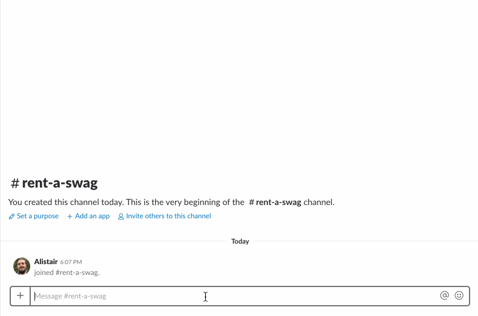

# dj-roomba
Slack bot for playing music on Sonos

<p align="center">
  
</p>

---

Use DJ Roomba to control your Sonos from Slack. It supports adding tracks from
Spotify, and can manage multiple Sonos locations, such as a different speaker in
multiple offices. Specific locations can be targetted by name, otherwise DJ
Roomba will attempt to match a location using your timezone and the timezones
set for each location (if set).





## Setup

1. Clone this repository

2. Create a `.env` file in the root directory, with values for the variables
   below. You can use the `.env.example` as a starting point by
   `cp .env.example .env`
   - `SPOTIFY_CLIENT_ID` - Client ID for your Spotify app
   - `SPOTIFY_CLIENT_SECRET` - Client secret for your Spotify app
     - You can create a Spotify app at
       https://developer.spotify.com/dashboard/applications
   - `MUSIXMATCH_TOKEN` - (optional) Provide a MusixMatch token for more
     accurate search results
     - You can create a MusixMatch app at
       https://developer.musixmatch.com/signup

   - **Locations** - the following are the environment variables required for
     each Sonos location. To add multiple, simply create a new set with the next
     number, eg. `LOCATION_1_NAME`, `LOCATION_2_NAME`, etc. The
     `docker-compose.yml` file supports up to 5, though there is no imposed
     limit.
     - `LOCATION_1_NAME` - Name of the location
       - Used when selecting the location from a command. If ommitted, this
         location can only be selected when inferred from the requesters
         timezone.
     - `LOCATION_1_TIMEZONE` - Timezone the of the location
       - If the requester hasn't specified a location, a location will be
         inferred based on matching timezone. If omitted, this location can only
         be selected by specifying the location name.
     - `LOCATION_1_SPOTIFY_REGION` - Region your Spotify account on Sonos is set
        to (eg. 'EU', 'US', etc.)
     - `LOCATION_1_SPOTIFY_MARKET` - Market your Spotify account uses (eg. 'GB',
       'US', etc.)
     - `LOCATION_1_SONOS_ADDRESS` - IP address of your Sonos
     - `LOCATION_1_DEFAULT_VOLUME` - (optional) The default volume to set before
       playing a song
        - Defaults to 60% if not set

   - Variables used by `@shopkeep/bot-scripts`
     - `SLACK_BOT_TOKEN` - token for the slack bot to connect to your slack
       workspace
       - You can create a new bot your workspace at
         `https://<your_workspace>.slack.com/apps/manage/custom-integrations`
         and selecting "Bots"
     - `LOGGING_LEVEL` - (optional) Level of logging to output. Defaults to
       `info`. Follows the
       [Syslog severity levels](https://en.wikipedia.org/wiki/Syslog#Severity_level).

3. Start the bot, and try using the `ping` command to make sure it's responding.

### Docker
Use `docker-compose` to build the environment and run the bot.
```
docker-compose build service
docker-compose run service
```

### Locally
Make sure you have Node.js and npm available. Install dependencies and run the
bot:
```
npm install
npm start
```


## Commands

### help

The details noted here.

*Note:* The "in `location`" section of commands is optional, but can be used to target a specific Sonos. It must match a location name known by the bot.
If you don't provide it, the system will infer a location based on your timezone. If you do provide it, don't forget the `,` to separate the location name from the artist name.

Play and queue commands can be tested first by appending `dry run` in front of them, eg. `dry run play "my song"`.
This will do everything, except actually play or queue the track, and can be useful for checking what song will be matched before you play it.

### ping

Checks that the bot's alive. If it replies `PONG`, you're good to go.

### play `song title` by `artist`(, in `location`)

Plays the matched song based on the title and artist provided.

### play `song title or artist`(, in `location`)

Plays the best match based on the title or artist provided.

### play `spotify:track:spotify-track-uuid`(, in `location`)

Plays a specific Spotify track.

### I'm feeling lucky(, in `location`)

Plays a random song.

### queue `song title` by `artist`(, in `location`)

Queues the matched song based on the title and artist provided.

### queue `song title or artist`(, in `location`)

Queues the best match based on the title or artist provided.

### queue `spotify:track:spotify-track-uuid`(, in `location`)

Queues a specific Spotify track.

### pause(, in `location`)

Pauses currently playing song.

### show playing(, in `location`)

Displays the currently playing song.

### show queue(, in `location`)

Displays the queue of upcoming songs.


## Contributing

Pull requests on this bot are very welcome. There is test and linting tooling in
place. Formatting is provided by prettier.

```
npm test        # Run all tests with jest
npm run lint    # Lint the codebase with eslint
```

Testing and linting can be run with `docker-compose` (good for CI)
```
docker-compose build test
docker-compose run test
```
